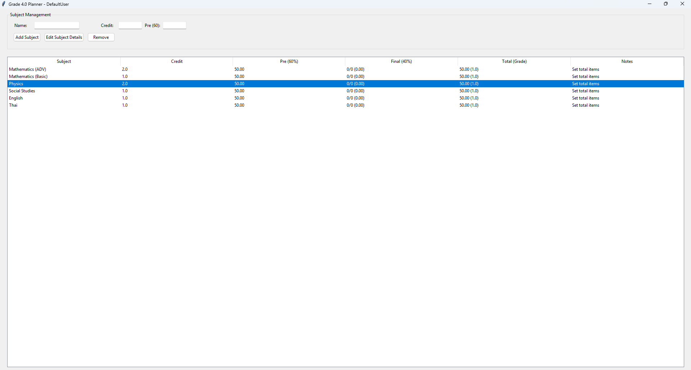

# Grade Calculator Program
Side Project 

## Project Details:

I created this program to help people calculate their minimum points on final exam to acheieve their desired grade.

---

## Project Status:

| Detail | Value |
| :--- | :--- |
| **Purpose** | Grade Prediction |
| **Current Version** | 1.2.0 |
| **Latest Edit** | January 1, 2026|

---



---

## For Developers: Compiling to a Standalone (.EXE):

If you want to create a standalone executable (`.exe`) file for Windows, you can use the **PyInstaller** package.

**Note:** Since this is a GUI application, we use the `--windowed` flag to prevent the console window from opening when the program runs.

1.  **Install PyInstaller**
    * Open your command line (Terminal or Command Prompt) and run the installation command:
        ```bash
        pip install pyinstaller
        ```

2.  **Navigate to the Script Directory**
    * Change your directory to the folder containing the main script (assuming the filename is still **`GUI Grading System.py`**):
        ```bash
        cd path\to\your\script\folder
        ```

3.  **Compile the Executable**
    * Run the PyInstaller command:
        ```bash
        pyinstaller --onefile --windowed "GUI Grading System.py"
        ```

**Result:** The final executable, **`GUI Grading System.exe`**, will be generated in the **`dist`** folder within your script's directory.

---

## ⚠️ Deployment Note:

This GUI is a currently a shared user since I didn't add a user login function.


